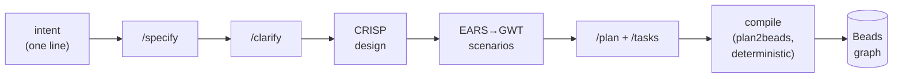
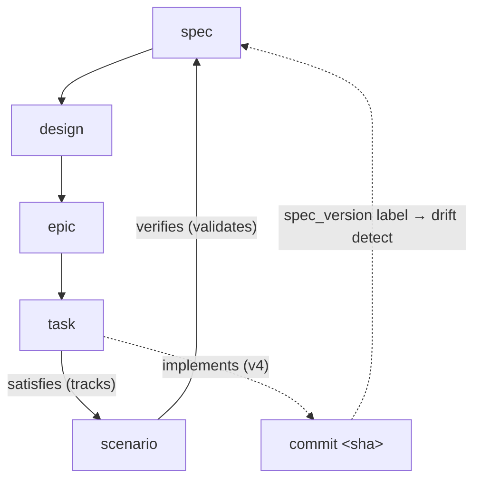
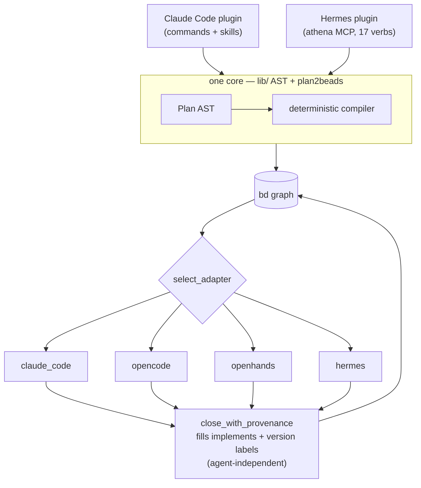

# Athena — a spec-driven planning framework (v3 + v3.1)

Turn a one-line intent into a **complete, traceable, compilable plan** — and a durable
**provenance graph** where every task's success check is a *proof that a requirement holds*,
not just "a test passed."

The pipeline chains existing, proven pieces and adds the deterministic glue between them:

`intent → Spec-Kit /specify → /clarify → CRISP design → EARS→GWT scenarios → /plan → /tasks → compile → Beads graph`

- **① CRISP/QRSPI** — agentic harness: alignment + context discipline (`matanshavit/qrspi`).
- **② GitHub Spec-Kit** — native deterministic spec: requirements / plan / `tasks.md` (`github/spec-kit`).
- **③ Beads `bd`** — durable task-graph on Dolt (`gastownhall/beads`).

Shipped as **two plugins** over one core:

- **Claude Code plugin** — `.claude-plugin/plugin.json` + `commands/` + `skills/`; Claude
  Code is the canonical agent that executes the Spec-Kit + CRISP slash-commands.
- **Hermes plugin** — `hermes/` workflows + the **athena MCP** (17 `planner_*` verbs) so an
  autonomous Hermes swarm can drive the same pipeline. See `hermes/HERMES_PLUGIN.md`.

**Execution (`implement`) is currently DEFERRED** (`ralph/INTERFACE.md`). Closing the
bidirectional code↔spec loop — `task→commit`, `commit→scenario`, and a version-drift
detector — is the **v4** roadmap.

## Architecture

### The pipeline — one-line intent to a compiled graph



### The provenance graph + the v4 bidirectional link

The left half (plan) is built today; `implements` is the reserved edge v4 fills so the
right half (code) ties back — `success_check` makes each link *checkable*, not declarative.



`trace_down(spec) → … → commit` · `trace_up(commit) → … → spec` · `trace_proof(spec)` runs
the scenarios on the current code → "does it still conform?"

### Two plugins, one core, any executor



### What v3 / v3.1 add over the original

- **v3 — provenance graph.** `spec → design → epic → task` parent chain, each LLM-hop output
  pinned by a content hash (`spec_version`, `design_version`, `scenario_version`).
- **v3.1 — executable scenario harness.** One Given-When-Then `Scenario` per EARS criterion;
  `scenario --verifies(validates)--> spec` and `task --satisfies(tracks)--> scenario` edges,
  so `success_check = requirement proved`.

### Proof it works

- **126 core tests + 7 v3.1 edge tests green.**
- **Real-pipeline eval: 0.92 mean recall, coverage 1.0** over a 5-task corpus × 3 runs
  (answer-key-isolated). See [`evals/`](./evals/).
- **End-to-end showcase:** [`examples/snake_game/`](./examples/snake_game/) — a 4-sentence
  "build Snake" intent expanded by the frame into 44 FRs / 24 edge cases / 31 scenarios /
  8 phases / 27 tasks → a **68-node, 84-edge** bd provenance graph.

Design docs: [v2](./athena-final-opus-plan-v2.md) ·
[v3](./athena-final-opus-plan-v3.md) ·
[v3.1 harness](./athena-opus-plan-v3.1-harness.md).

## What we write vs. vendor (§0)

| Layer | Source | Ours? |
|---|---|---|
| ① CRISP/QRSPI | vendored (`vendor/crisp/`) | no |
| ② Spec-Kit | install + `speckit/presets/athena/` preset | preset + parser |
| ③ Beads `bd` | install (`gastownhall/beads` v1.x) | no |
| **compiler** (`Plan` AST → bd) | **us** | **yes — the core** |
| **Athena MCP** (verbs for Hermes) | **us** | **yes** |
| **toggle** (3-layer ↔ 2-layer) | **us** | **yes** |
| ④ implement (Ralph/OpenHands/Claurst) | — | **DEFERRED — interface stub only** |

## Toggle (`ATHENA_SPECKIT`)

- `on` (primary, 3-layer): CRISP → Spec-Kit `tasks.md` → `speckit_parser` → AST → compile.
- `off` (fallback, 2-layer): CRISP `5_plan` → `plan.md` → `plan_parser` → AST → compile.

Both parsers emit the SAME `lib/ast.py` `Plan`; the compiler never sees the toggle.

## Layout (§2)

```
nexus-athena/
├── commands/crisp/{1..5}_*.md     # CRISP front (5_plan = fallback only)         [done]
├── commands/compile.md            # /athena.compile — toggle by ATHENA_SPECKIT    [done]
├── speckit/{presets/athena, seed.md}  # success_check preset + phase-by-phase seed [done]
├── skills/{plan-format, speckit-tasks-format}/SKILL.md  # fallback + primary schemas [done]
├── agents/                        # documentarian subagents                       [done]
├── lib/
│   ├── ast.py                     # shared Plan AST (the contract)                [done]
│   ├── plan_parser.py             # plan.md  -> Plan  (fallback)                  [done]
│   ├── speckit_parser.py          # tasks.md -> Plan  (primary)                   [done]
│   ├── frontend.py                # toggle: pick parser by ATHENA_SPECKIT         [done]
│   ├── plan2beads.py              # DETERMINISTIC compiler (AST -> bd)            [done]
│   └── bd_client.py               # only subprocess boundary                      [done]
├── mcp/athena_mcp/                # FastMCP server — §7 verbs                      [done]
├── ralph/INTERFACE.md             # [DEFERRED] executor contract (impl @ v1-full) [stub]
├── tests/                         # ast + both parsers + golden guard + compiler + toggle
└── vendor/{crisp, spec-kit}/      # pinned refs (schema reproducibility)          [done]
```

## Vendored provenance

- CRISP: `matanshavit/qrspi` @ `8d710510643ab483708fd127bd7c9b4ca2951f48`
- Spec-Kit: `github/spec-kit` @ `90832d19bf7dcdaacc86301ea1e3cf85a9377b7d` (schema pinned; golden guard)

## Quick start

```bash
bash install.sh        # bd (v1.x) + bd init + Spec-Kit (specify) + plugin/MCP register
python -m pytest tests/ -q                 # core suite
cd mcp/athena_mcp && uv run pytest -q       # MCP verbs
```

## Build status

Planning layers (Phases 0–9) built + tested. **Phase 10** (end-to-end dogfood in both toggle
modes) needs `specify` + `bd` installed + a live run — that's the boundary. `implement` is
deferred by design.

## License

MIT (vendored templates retain their upstream licenses — see `vendor/*/`).
