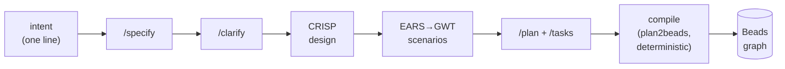
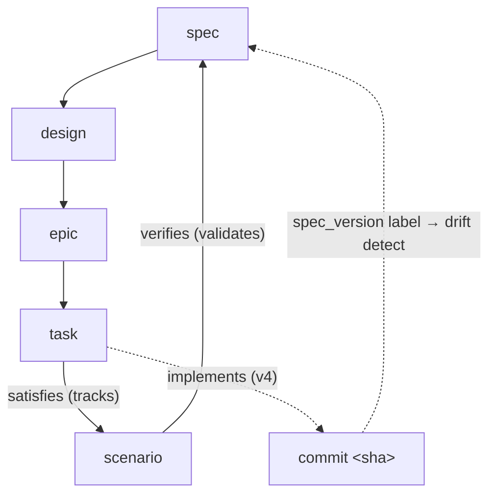
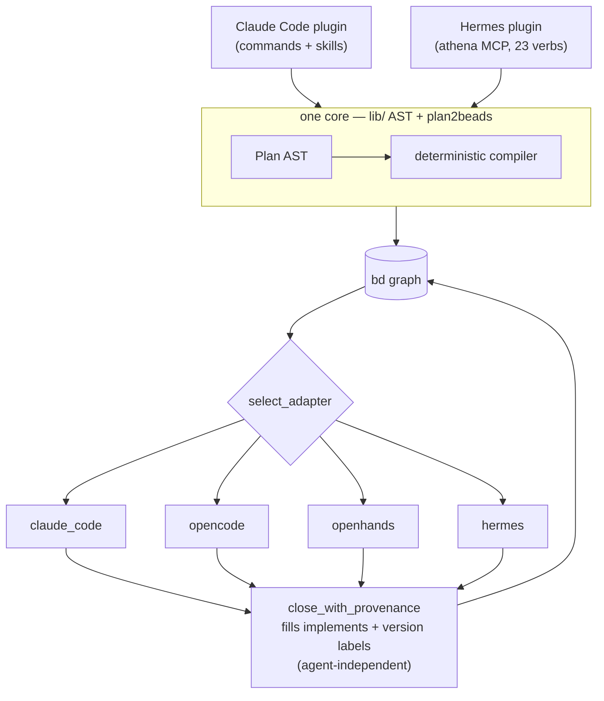
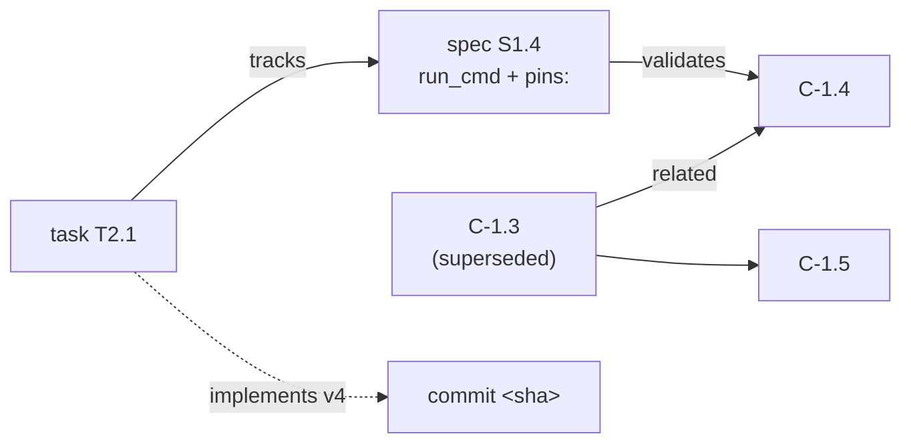

# Athena — a spec-driven planning framework (v3 + v3.1 + v3.3)

Turn a one-line intent into a **complete, traceable, compilable plan** — and a durable
**provenance graph** where every task's success check is a *proof that a requirement holds*,
not just "a test passed."

**v3.3 adds the requirement contract**: numbered clauses with immutable ids that are
*superseded, never edited in place*, so a reference written months ago keeps resolving. Each
clause is bound to an executable spec, which makes three questions a linear scan instead of a
re-read of the codebase — *which requirements have no spec*, *what is left to implement*, and
*where requirement, spec and code diverged*. See [Requirement contract](#requirement-contract-v33).

The pipeline chains existing, proven pieces and adds the deterministic glue between them:

`intent → Spec-Kit /specify → /clarify → CRISP design → EARS→GWT scenarios → /plan → /tasks → compile → Beads graph`

- **① CRISP/QRSPI** — agentic harness: alignment + context discipline (`matanshavit/qrspi`).
- **② GitHub Spec-Kit** — native deterministic spec: requirements / plan / `tasks.md` (`github/spec-kit`).
- **③ Beads `bd`** — durable task-graph on Dolt (`gastownhall/beads`).

Shipped as **two plugins** over one core:

- **Claude Code plugin** — `.claude-plugin/plugin.json` + `commands/` + `skills/`; Claude
  Code is the canonical agent that executes the Spec-Kit + CRISP slash-commands.
- **Hermes plugin** — `hermes/` workflows + the **athena MCP** (23 `planner_*` verbs) so an
  autonomous Hermes swarm can drive the same pipeline. See `hermes/HERMES_PLUGIN.md`.

**Execution (`implement`) is currently DEFERRED** (`ralph/INTERFACE.md`). Closing the
bidirectional code↔spec loop — `task→commit`, `commit→scenario`, and a version-drift
detector — is the **v4** roadmap.

## Architecture

### The pipeline — one-line intent to a compiled graph


```mermaid
flowchart LR
  I["intent<br/>(one line)"] --> SP["/specify"]
  SP --> CL["/clarify"]
  CL --> DS["CRISP<br/>design"]
  DS --> SC["EARS→GWT<br/>scenarios"]
  SC --> PL["/plan + /tasks"]
  PL --> CO["compile<br/>(plan2beads,<br/>deterministic)"]
  CO --> G[("Beads<br/>graph")]
```

### The provenance graph + the v4 bidirectional link

The left half (plan) is built today; `implements` is the reserved edge v4 fills so the
right half (code) ties back — `success_check` makes each link *checkable*, not declarative.


```mermaid
flowchart TB
  spec["spec"] --> design["design"] --> epic["epic"] --> task["task"]
  scenario["scenario"] -- "verifies (validates)" --> spec
  task -- "satisfies (tracks)" --> scenario
  task -. "implements (v4)" .-> commit["commit &lt;sha&gt;"]
  commit -. "spec_version label → drift detect" .-> spec
```

`trace_down(spec) → … → commit` · `trace_up(commit) → … → spec` · `trace_proof(spec)` runs
the scenarios on the current code → "does it still conform?"

### Two plugins, one core, any executor


```mermaid
flowchart TB
  CC["Claude Code plugin<br/>(commands + skills)"] --> CORE
  HP["Hermes plugin<br/>(athena MCP, 23 verbs)"] --> CORE
  subgraph CORE["one core — lib/ AST + plan2beads"]
    AST["Plan AST"] --> CMP["deterministic compiler"]
  end
  CORE --> G[("bd graph")]
  G --> SEL{"select_adapter"}
  SEL --> A1["claude_code"]
  SEL --> A2["opencode"]
  SEL --> A3["openhands"]
  SEL --> A4["hermes"]
  A1 & A2 & A3 & A4 --> CWP["close_with_provenance<br/>fills implements + version labels<br/>(agent-independent)"]
  CWP --> G
```

### What v3 / v3.1 / v3.3 add over the original

- **v3 — provenance graph.** `spec → design → epic → task` parent chain, each LLM-hop output
  pinned by a content hash (`spec_version`, `design_version`, `scenario_version`).
- **v3.1 — executable scenario harness.** One Given-When-Then `Scenario` per EARS criterion;
  `scenario --verifies(validates)--> spec` and `task --satisfies(tracks)--> scenario` edges,
  so `success_check = requirement proved`.
- **v3.3 — requirement contract.** Numbered clauses (`C-3.2`) with immutable ids and
  supersede/branch semantics become the graph ROOT (`kind:clause`), each with its OWN version
  hash, and each spec pins the clause wording it was written against.

## Quick start (v3.5)

```bash
python athena.py init features/my-feature --title "My Feature"    # contract + specs + plan + an example test
python athena.py check features/my-feature/contract.md        --front features/my-feature/plan.md --run --text           # the whole loop, one exit code
```

There is no `athena` on PATH: the tool is invoked as `python athena.py` from the repo root
(an audit ran the quick start verbatim and the first line failed with `command not found`).
On a fresh project the reverse leg has no evidence yet, so the verdict is **INCOMPLETE**
until you build the clause map — that is the honest state, not a failure:

```bash
python athena.py contract map features/my-feature/contract.md --source src   # minutes
```

```
[ok] contract
   ok   contract.lint
   ok   contract.wording
[ok] specs_to_code
   ok   coverage               live=129
   ok   spec.run               passed=129, total=129
   ok   todo                   counts={'unspecified': 0, 'red': 0, 'unrun': 0, 'stale': 0, 'done': 129}
   ok   drift
   ok   seam.contract_bound
[ok] code_to_specs
   ok   seam.map_fresh

verdict: PASS
```

Two legs, answered separately because they are different questions:

| leg | asks | fails when |
|---|---|---|
| `specs_to_code` | is every requirement proved by a bound, pinned, green spec? | uncovered / red / unrun / stale / drifted |
| `code_to_specs` | is the code the specs claim to own still the code they own — and do those specs prove anything? | the clause map is stale, or a mutant survived |

`--deep` adds mutation over the clauses that drifted; `--strict` promotes wording findings and
surviving mutants from advisory to blocking. A CI recipe with both lanes is in
[`ci/athena-check.yml`](./ci/athena-check.yml).

The fastest way into an existing contract is the derived outline — no architecture page to
write or to outgrow, because it is read out of the clause map:

```bash
python athena.py contract outline features/contract-layer/contract.md --text
```

```
C-9 The per-clause file:line map  (20 live, 2 superseded)  proved 20/20
    home: lib/clause_map.py (136 lines)  lib/seams.py (66 lines)
    shared: lib/contract.py, lib/ast.py, lib/versioning.py
```

A group's **home** is a module holding lines only that group owns; a module it merely
executes on the way in is **shared** and credited to nobody. Exclusivity is per line, so one
file can be the home of two groups that live in different parts of it — `lib/contract.py`
belongs to both the parser (C-1) and the wording critique (C-7).

## Requirement contract (v3.3)

A spec.md is prose with implicit numbering: renumber it and every `verifies: R4.2` written
last month silently points somewhere else — the reference rots without a single test going
red. A contract fixes identity instead: an id is allocated once, never reused, and a
requirement that changes is **superseded** by one or more successors.


```mermaid
flowchart LR
  C13["C-1.3<br/>(superseded)"] -->|related| C14["C-1.4"]
  C13 --> C15["C-1.5"]
  S["spec S1.4<br/>run_cmd + pins:"] -->|validates| C14
  T["task T2.1"] -->|tracks| S
  T -.->|implements v4| K["commit &lt;sha&gt;"]
```

`resolve("C-1.3") → (C-1.4, C-1.5)` — the old reference still lands somewhere current.

```bash
python athena.py contract lint     contract.md            # ids, dangling refs, cycles
python athena.py contract coverage contract.md --text     # Q1 clauses with no spec
python athena.py spec run          scenarios.md --skip-tag slow  # -> .athena/spec_ledger.json
python athena.py contract todo     contract.md --ledger .athena/spec_ledger.json --text
python athena.py contract drift    contract.md --ledger .athena/spec_ledger.json --text
python athena.py seam contract_bound plan.md --speckit off   # fail-closed gate
python athena.py contract import   spec.md -o contract.md    # migrate, ids VERBATIM
```

`todo` buckets every live clause as `unspecified | red | unrun | stale | done` (+ `draft`
backlog). `drift` reports `spec_drift` / `stale_proof` / `missing_spec` / `extra_spec` — the
two middle ones are what no test suite can tell you: every spec is green, but it is proving an
older wording of the requirement. Format rules: `skills/contract-format/SKILL.md`.
Adoption is opt-in — with no `contract.md` attached, compiler output is byte-identical to v3.1.

### Dogfood — the frame applied to itself

[`features/contract-layer/`](./features/contract-layer/) is Athena's own contract for the
feature that adds contracts: **159 clauses (149 live) ↔ 149 executable specs**, each `run_cmd` a
real pytest node in this repo, plus a committed `spec_ledger.json` and a `clause_map.json`
owning 1657 lines across 20 modules. Compiles to a **300+ node bd graph** (clause + scenario
+ epic + task nodes). [`features/contract-layer/README.md`](./features/contract-layer/README.md)
is the way in: what each of the seven artifacts is, who writes it, and the format on one screen.

Running the reports on itself found a real defect: with only four buckets, `todo` answered
"nothing left" for a clause whose proof was stale while `drift` said the contract was out of
sync. Clause `C-4.5` was therefore **superseded by `C-4.13`** (the `stale` bucket) rather than
edited — `resolve("C-4.5") → C-4.13`, and the old id still works. A second finding came from
the repo's own audit rules: the first cut of the runner used `shell=True` on a `run_cmd`,
contradicting the policy `planner_verify` had already set (a run_cmd is an LLM-hop output);
the runner is now shell-less with a refusal path, written down as clause `C-3.10`. Third,
the unit tests only asserted the SHAPE of the emitted `bd` commands — the very gap that let
v3.1 ship `bd related`, a command bd does not have — so clause `C-5.11` and a real-`bd`
integration spec now prove that bd actually *accepts* the clause nodes and the
supersede/validates edges.

The fourth finding is the best advert for keeping wrong guesses on the record. The draft
clause `C-3.9` promised a sub-five-second suite **by batching specs into one process**.
Measuring killed that mechanism: of the 10.8 s a spec took, **10.3 s was third-party pytest
plugin autoload** (22 plugins installed on the box), the pool was hardcoded to 8 workers on
an 18-core machine, and even after both fixes the clock was pinned by ONE inherently slow
spec (real `bd` + Dolt init: 100.5 s against a 1.21 s median). So `C-3.9` was **superseded by
`C-3.11`** (pool = machine cores, caller-pinnable env) **and `C-3.12`** (include/exclude specs
by clause tag). Measured result:

| lane | before | after |
|---|---|---|
| 47 specs, `--skip-tag slow` | ~101 s | **2.1 s** |
| all 48 specs incl. real `bd` | ~112 s | 58 s |

```bash
python athena.py spec run scenarios.md --skip-tag slow --env PYTEST_DISABLE_PLUGIN_AUTOLOAD=1
```
`--jobs` now defaults to the machine's logical cores; `--env` is a knob, never a default,
because a suite may genuinely need a plugin.

### Proof it works

- **All specs green**: the loop reports PASS on both legs; see `athena check --text`.
- **Real-pipeline eval: 0.92 mean recall, coverage 1.0** over a 5-task corpus × 3 runs
  (answer-key-isolated). See [`evals/`](./evals/).
- **End-to-end showcase:** [`examples/snake_game/`](./examples/snake_game/) — a 4-sentence
  "build Snake" intent expanded by the frame into 44 FRs / 24 edge cases / 31 scenarios /
  8 phases / 27 tasks → a **68-node, 84-edge** bd provenance graph.

Design docs: [v2](./athena-final-opus-plan-v2.md) ·
[v3](./athena-final-opus-plan-v3.md) ·
[v3.1 harness](./athena-opus-plan-v3.1-harness.md).

## What we write vs. vendor (§0)

| Layer | Source | Ours? |
|---|---|---|
| ① CRISP/QRSPI | vendored (`vendor/crisp/`) | no |
| ② Spec-Kit | install + `speckit/presets/athena/` preset | preset + parser |
| ③ Beads `bd` | install (`gastownhall/beads` v1.x) | no |
| **compiler** (`Plan` AST → bd) | **us** | **yes — the core** |
| **Athena MCP** (verbs for Hermes) | **us** | **yes** |
| **toggle** (3-layer ↔ 2-layer) | **us** | **yes** |
| ④ implement (Ralph/OpenHands/Claurst) | — | **DEFERRED — interface stub only** |

## Toggle (`ATHENA_SPECKIT`)

- `on` (primary, 3-layer): CRISP → Spec-Kit `tasks.md` → `speckit_parser` → AST → compile.
- `off` (fallback, 2-layer): CRISP `5_plan` → `plan.md` → `plan_parser` → AST → compile.

Both parsers emit the SAME `lib/ast.py` `Plan`; the compiler never sees the toggle.

## Layout (§2)

```
nexus-athena/
├── commands/crisp/{1..5}_*.md     # CRISP front (5_plan = fallback only)         [done]
├── commands/compile.md            # /athena.compile — toggle by ATHENA_SPECKIT    [done]
├── speckit/{presets/athena, seed.md}  # success_check preset + phase-by-phase seed [done]
├── skills/{plan-format, speckit-tasks-format}/SKILL.md  # fallback + primary schemas [done]
├── agents/                        # documentarian subagents                       [done]
├── features/contract-layer/       # v3.3 dogfood: Athena's own contract + specs    [done]
├── skills/contract-format/        # the formal clause language (v3.3)             [done]
├── commands/contract.md           # /athena.contract — the three questions        [done]
├── lib/
│   ├── contract.py                # contract.md -> clauses (parse/lint/pin/import) [done]
│   ├── spec_runner.py             # run executable specs -> red/green ledger       [done]
│   ├── contract_report.py         # coverage / todo / drift (pure, linear)         [done]
│   ├── ast.py                     # shared Plan AST (the contract)                [done]
│   ├── plan_parser.py             # plan.md  -> Plan  (fallback)                  [done]
│   ├── speckit_parser.py          # tasks.md -> Plan  (primary)                   [done]
│   ├── frontend.py                # toggle: pick parser by ATHENA_SPECKIT         [done]
│   ├── plan2beads.py              # DETERMINISTIC compiler (AST -> bd)            [done]
│   └── bd_client.py               # only subprocess boundary                      [done]
├── mcp/athena_mcp/                # FastMCP server — §7 verbs                      [done]
├── ralph/INTERFACE.md             # [DEFERRED] executor contract (impl @ v1-full) [stub]
├── tests/                         # ast + both parsers + golden guard + compiler + toggle
└── vendor/{crisp, spec-kit}/      # pinned refs (schema reproducibility)          [done]
```

## Vendored provenance

- CRISP: `matanshavit/qrspi` @ `8d710510643ab483708fd127bd7c9b4ca2951f48`
- Spec-Kit: `github/spec-kit` @ `90832d19bf7dcdaacc86301ea1e3cf85a9377b7d` (schema pinned; golden guard)

## Quick start

```bash
bash install.sh        # bd (v1.x) + bd init + Spec-Kit (specify) + plugin/MCP register
python -m pytest tests/ -q                 # core suite
cd mcp/athena_mcp && uv run pytest -q       # MCP verbs
```

## Build status

Planning layers (Phases 0–9) built + tested. **Phase 10** (end-to-end dogfood in both toggle
modes) needs `specify` + `bd` installed + a live run — that's the boundary. `implement` is
deferred by design.

## License

MIT (vendored templates retain their upstream licenses — see `vendor/*/`).
