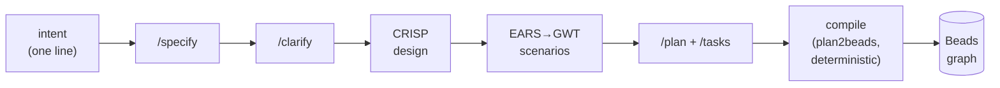
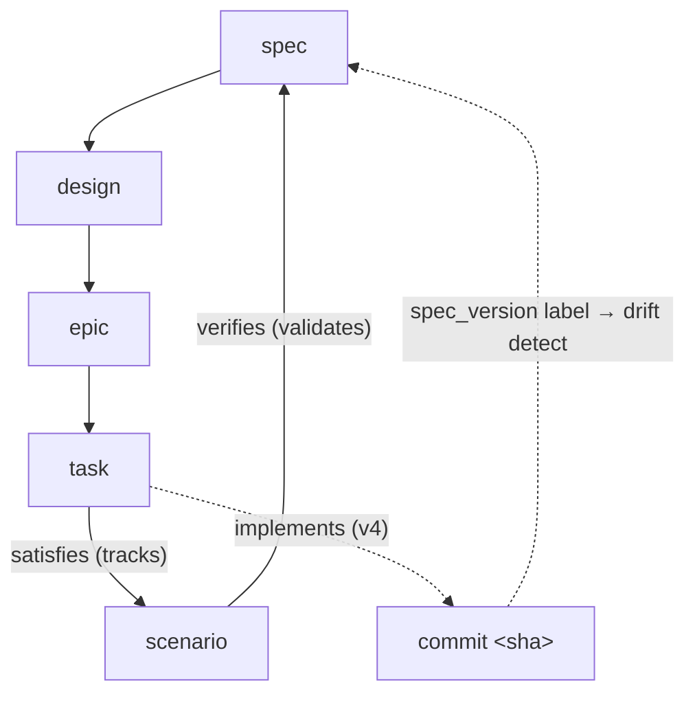
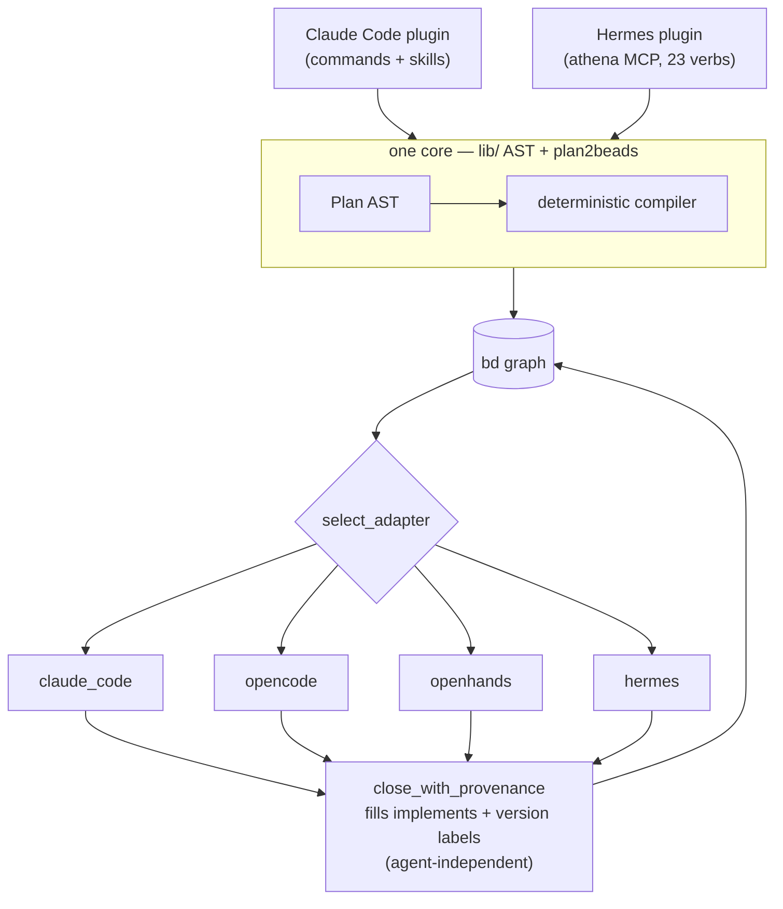
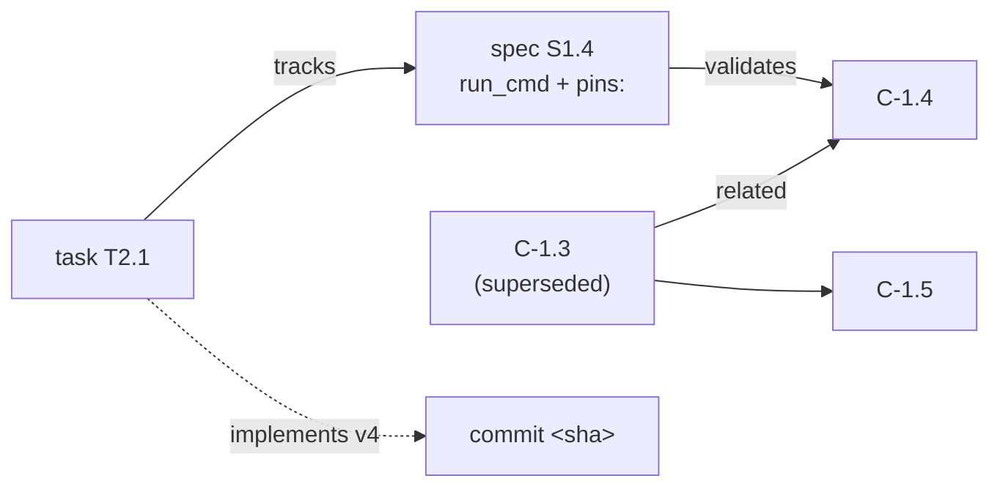

# Athena — a spec-driven planning framework (v3 + v3.1 + v3.3 + v3.10 + v3.11)

> **Start here:** [`CORE.md`](./CORE.md) (goal, language, priorities, constraints; forty
> lines), then [`CLAUDE.md`](./CLAUDE.md) (the way in, one screen), then the feature you
> touch under `features/<name>/`. This README is the long form.

Turn a one-line intent into a **complete, traceable, compilable plan** — and a durable
**provenance graph** where every task's success check is a *proof that a requirement holds*,
not just "a test passed."

**v3.3 adds the requirement contract**: numbered clauses with immutable ids that are
*superseded, never edited in place*, so a reference written months ago keeps resolving. Each
clause is bound to an executable spec, which makes three questions a linear scan instead of a
re-read of the codebase — *which requirements have no spec*, *what is left to implement*, and
*where requirement, spec and code diverged*. See [Requirement contract](#requirement-contract-v33).

**v3.10 adds the top of the pyramid and its edges**, written contract-first in
[`features/core-layer/`](./features/core-layer/): a semantic core the clauses cite by
fingerprint (a change to the principles makes them *suspect* until re-read), a `source:` on
every clause so lessons are a linear scan, `athena lessons rerun` as the check that a lesson
was learned, `athena gate` judging every contract in the repository on Stop, and a spec lane
that runs many specs in one process. See [The core layer](#the-core-layer-v310).

**v3.11 closes seven gaps against modern AI-native practice**, again contract-first in
[`features/team-layer/`](./features/team-layer/): specs as data run in-process, decisions
kept in `docs/adr/` with a human owner, `athena intake` from a failure to a draft clause
and a red spec, lane-based ids for parallel authors, a pre-edit hook that hands the agent
the blast radius and refuses hand-edits of derived artifacts, an architecture lint, budgets
with a record of runs, and property-based proofs. See [The team layer](#the-team-layer-v311).

**v3.12 closes the deferred executor**, in [`features/executor-layer/`](./features/executor-layer/):
`athena dispatch` derives a work packet from contract, scenarios and plan, pours it into a
local lane, an OpenHands run or Claude Code, and judges the attempt by the workspace diff and
the spec commands; the executor's report is recorded and ignored. See
[The executor layer](#the-executor-layer-v312).

The pipeline chains existing, proven pieces and adds the deterministic glue between them:

`intent → Spec-Kit /specify → /clarify → CRISP design → EARS→GWT scenarios → /plan → /tasks → compile → Beads graph`

- **① CRISP/QRSPI** — agentic harness: alignment + context discipline (`matanshavit/qrspi`).
- **② GitHub Spec-Kit** — native deterministic spec: requirements / plan / `tasks.md` (`github/spec-kit`).
- **③ Beads `bd`** — durable task-graph on Dolt (`gastownhall/beads`).

Shipped as **two plugins** over one core:

- **Claude Code plugin** — `.claude-plugin/plugin.json` + `commands/` + `skills/`; Claude
  Code is the canonical agent that executes the Spec-Kit + CRISP slash-commands.
- **Hermes plugin** — `hermes/` workflows + the **athena MCP** (23 `planner_*` verbs) so an
  autonomous Hermes swarm can drive the same pipeline. See `hermes/HERMES_PLUGIN.md`.

**Execution (`implement`)** was deferred until v3.12; `athena dispatch` now pours one plan
task into an executor and judges it by diff and specs (`features/executor-layer/`). The
bd-side loop (`ralph/INTERFACE.md`) and the `implements` edge (v4) sit on top of it.

## Architecture

### The pipeline — one-line intent to a compiled graph


```mermaid
flowchart LR
  I["intent<br/>(one line)"] --> SP["/specify"]
  SP --> CL["/clarify"]
  CL --> DS["CRISP<br/>design"]
  DS --> SC["EARS→GWT<br/>scenarios"]
  SC --> PL["/plan + /tasks"]
  PL --> CO["compile<br/>(plan2beads,<br/>deterministic)"]
  CO --> G[("Beads<br/>graph")]
```

### The provenance graph + the v4 bidirectional link

The left half (plan) is built today; `implements` is the reserved edge v4 fills so the
right half (code) ties back — `success_check` makes each link *checkable*, not declarative.


```mermaid
flowchart TB
  spec["spec"] --> design["design"] --> epic["epic"] --> task["task"]
  scenario["scenario"] -- "verifies (validates)" --> spec
  task -- "satisfies (tracks)" --> scenario
  task -. "implements (v4)" .-> commit["commit &lt;sha&gt;"]
  commit -. "spec_version label → drift detect" .-> spec
```

`trace_down(spec) → … → commit` · `trace_up(commit) → … → spec` · `trace_proof(spec)` runs
the scenarios on the current code → "does it still conform?"

### Two plugins, one core, any executor


```mermaid
flowchart TB
  CC["Claude Code plugin<br/>(commands + skills)"] --> CORE
  HP["Hermes plugin<br/>(athena MCP, 23 verbs)"] --> CORE
  subgraph CORE["one core — lib/ AST + plan2beads"]
    AST["Plan AST"] --> CMP["deterministic compiler"]
  end
  CORE --> G[("bd graph")]
  G --> SEL{"select_adapter"}
  SEL --> A1["claude_code"]
  SEL --> A2["opencode"]
  SEL --> A3["openhands"]
  SEL --> A4["hermes"]
  A1 & A2 & A3 & A4 --> CWP["close_with_provenance<br/>fills implements + version labels<br/>(agent-independent)"]
  CWP --> G
```

### What v3 / v3.1 / v3.3 add over the original

- **v3 — provenance graph.** `spec → design → epic → task` parent chain, each LLM-hop output
  pinned by a content hash (`spec_version`, `design_version`, `scenario_version`).
- **v3.1 — executable scenario harness.** One Given-When-Then `Scenario` per EARS criterion;
  `scenario --verifies(validates)--> spec` and `task --satisfies(tracks)--> scenario` edges,
  so `success_check = requirement proved`.
- **v3.3 — requirement contract.** Numbered clauses (`C-3.2`) with immutable ids and
  supersede/branch semantics become the graph ROOT (`kind:clause`), each with its OWN version
  hash, and each spec pins the clause wording it was written against.

## Quick start (v3.5)

```bash
python athena.py init features/my-feature --title "My Feature"    # contract + specs + plan + an example test
python athena.py check features/my-feature/contract.md        --front features/my-feature/plan.md --run --text           # the whole loop, one exit code
```

There is no `athena` on PATH: the tool is invoked as `python athena.py` from the repo root
(an audit ran the quick start verbatim and the first line failed with `command not found`).
On a fresh project the reverse leg has no evidence yet, so the verdict is **INCOMPLETE**
until you build the clause map — that is the honest state, not a failure:

```bash
python athena.py contract map features/my-feature/contract.md --source src   # minutes
```

```
[ok] contract
   ok   contract.lint
   ok   contract.wording
[ok] specs_to_code
   ok   coverage               live=129
   ok   spec.run               passed=129, total=129
   ok   todo                   counts={'unspecified': 0, 'red': 0, 'unrun': 0, 'stale': 0, 'done': 129}
   ok   drift
   ok   seam.contract_bound
[ok] code_to_specs
   ok   seam.map_fresh

verdict: PASS
```

Two legs, answered separately because they are different questions:

| leg | asks | fails when |
|---|---|---|
| `specs_to_code` | is every requirement proved by a bound, pinned, green spec? | uncovered / red / unrun / stale / drifted |
| `code_to_specs` | is the code the specs claim to own still the code they own — and do those specs prove anything? | the clause map is stale, or a mutant survived |

`--deep` adds mutation over the clauses that drifted; `--strict` promotes wording findings and
surviving mutants from advisory to blocking. Depth is measured twice — the map records
**half-proved** lines (owned, but with a branch arm nothing took: 231 of 1724 here), and
`athena mutate --only exclusive+half-proved` breaks exactly those to see whether a bound spec
notices. First run on this repo: 17 mutants, 7 survived, with every spec green. A CI recipe with both lanes is in
[`ci/athena-check.yml`](./ci/athena-check.yml).

The fastest way into an existing contract is the derived outline — no architecture page to
write or to outgrow, because it is read out of the clause map:

```bash
python athena.py contract outline features/contract-layer/contract.md --text
```

```
C-9 The per-clause file:line map  (20 live, 2 superseded)  proved 20/20
    home: lib/clause_map.py (136 lines)  lib/seams.py (66 lines)
    shared: lib/contract.py, lib/ast.py, lib/versioning.py
```

A group's **home** is a module holding lines only that group owns; a module it merely
executes on the way in is **shared** and credited to nobody.

**Living apart from the code (v3.8).** Three links survive a repository boundary, each in a
notation that already exists: `- see: doc@fingerprint` on a clause (Doorstop's mechanism and
its word, **suspect link**, for a target that moved); `@relation(C-9.22, scope=function)` in
source (StrictDoc's notation — but a marker the clause map cannot back is reported `unbacked`,
because an annotation is a claim); and `athena contract export` publishing the clause index in
the sphinx-needs shape, so another repository references these requirements without a checkout.
The map records the codebase it describes as a package URL, and refuses to answer about
another one.

Exclusivity is per line, so one file can be the home of two groups that live in different
parts of it — `lib/contract.py` belongs to both the parser (C-1) and the wording critique
(C-7).

## Requirement contract (v3.3)

A spec.md is prose with implicit numbering: renumber it and every `verifies: R4.2` written
last month silently points somewhere else — the reference rots without a single test going
red. A contract fixes identity instead: an id is allocated once, never reused, and a
requirement that changes is **superseded** by one or more successors.


```mermaid
flowchart LR
  C13["C-1.3<br/>(superseded)"] -->|related| C14["C-1.4"]
  C13 --> C15["C-1.5"]
  S["spec S1.4<br/>run_cmd + pins:"] -->|validates| C14
  T["task T2.1"] -->|tracks| S
  T -.->|implements v4| K["commit &lt;sha&gt;"]
```

`resolve("C-1.3") → (C-1.4, C-1.5)` — the old reference still lands somewhere current.

```bash
python athena.py contract lint     contract.md            # ids, dangling refs, cycles
python athena.py contract coverage contract.md --text     # Q1 clauses with no spec
python athena.py spec run          scenarios.md --skip-tag slow  # -> .athena/spec_ledger.json
python athena.py contract todo     contract.md --ledger .athena/spec_ledger.json --text
python athena.py contract drift    contract.md --ledger .athena/spec_ledger.json --text
python athena.py seam contract_bound plan.md --speckit off   # fail-closed gate
python athena.py contract import   spec.md -o contract.md    # migrate, ids VERBATIM
```

`todo` buckets every live clause as `unspecified | red | unrun | stale | done` (+ `draft`
backlog). `drift` reports `spec_drift` / `stale_proof` / `missing_spec` / `extra_spec` — the
two middle ones are what no test suite can tell you: every spec is green, but it is proving an
older wording of the requirement. Format rules: `skills/contract-format/SKILL.md`.
Adoption is opt-in — with no `contract.md` attached, compiler output is byte-identical to v3.1.

### Dogfood — the frame applied to itself

[`features/contract-layer/`](./features/contract-layer/) is Athena's own contract for the
feature that adds contracts: **159 clauses (149 live) ↔ 149 executable specs**, each `run_cmd` a
real pytest node in this repo, plus a committed `spec_ledger.json` and a `clause_map.json`
owning 1657 lines across 20 modules. Compiles to a **300+ node bd graph** (clause + scenario
+ epic + task nodes). [`features/contract-layer/README.md`](./features/contract-layer/README.md)
is the way in: what each of the seven artifacts is, who writes it, and the format on one screen.

Running the reports on itself found a real defect: with only four buckets, `todo` answered
"nothing left" for a clause whose proof was stale while `drift` said the contract was out of
sync. Clause `C-4.5` was therefore **superseded by `C-4.13`** (the `stale` bucket) rather than
edited — `resolve("C-4.5") → C-4.13`, and the old id still works. A second finding came from
the repo's own audit rules: the first cut of the runner used `shell=True` on a `run_cmd`,
contradicting the policy `planner_verify` had already set (a run_cmd is an LLM-hop output);
the runner is now shell-less with a refusal path, written down as clause `C-3.10`. Third,
the unit tests only asserted the SHAPE of the emitted `bd` commands — the very gap that let
v3.1 ship `bd related`, a command bd does not have — so clause `C-5.11` and a real-`bd`
integration spec now prove that bd actually *accepts* the clause nodes and the
supersede/validates edges.

The fourth finding is the best advert for keeping wrong guesses on the record. The draft
clause `C-3.9` promised a sub-five-second suite **by batching specs into one process**.
Measuring killed that mechanism: of the 10.8 s a spec took, **10.3 s was third-party pytest
plugin autoload** (22 plugins installed on the box), the pool was hardcoded to 8 workers on
an 18-core machine, and even after both fixes the clock was pinned by ONE inherently slow
spec (real `bd` + Dolt init: 100.5 s against a 1.21 s median). So `C-3.9` was **superseded by
`C-3.11`** (pool = machine cores, caller-pinnable env) **and `C-3.12`** (include/exclude specs
by clause tag). Measured result:

| lane | before | after |
|---|---|---|
| 47 specs, `--skip-tag slow` | ~101 s | **2.1 s** |
| all 48 specs incl. real `bd` | ~112 s | 58 s |

```bash
python athena.py spec run scenarios.md --skip-tag slow --env PYTEST_DISABLE_PLUGIN_AUTOLOAD=1
```
`--jobs` now defaults to the machine's logical cores; `--env` is a knob, never a default,
because a suite may genuinely need a plugin.

### Proof it works

- **All specs green**: the loop reports PASS on both legs; see `athena check --text`.
- **Real-pipeline eval: 0.92 mean recall, coverage 1.0** over a 5-task corpus × 3 runs
  (answer-key-isolated). See [`evals/`](./evals/).
- **End-to-end showcase:** [`examples/snake_game/`](./examples/snake_game/) — a 4-sentence
  "build Snake" intent expanded by the frame into 44 FRs / 24 edge cases / 31 scenarios /
  8 phases / 27 tasks → a **68-node, 84-edge** bd provenance graph.

Design docs: [v2](./docs/history/athena-final-opus-plan-v2.md) ·
[v3](./docs/history/athena-final-opus-plan-v3.md) ·
[v3.1 harness](./docs/history/athena-opus-plan-v3.1-harness.md).

## The core layer (v3.10)

The contract layer answered "is it done" for requirement, spec and code. Above it sat nothing
a tool could check: why the requirements are what they are, where each one came from, whether
a lesson stayed learned, and whether the criterion was actually enforced (the Stop hook that
enforces it existed on disk for a month and was registered nowhere). Applying the frame to
itself, each of those is now a clause group in
[`features/core-layer/contract.md`](./features/core-layer/contract.md) — **33 clauses, 33
executable specs, written before the code** — and the whole layer holds under
`athena check` and `athena gate`.

| piece | what it is | command |
|---|---|---|
| **core** | `CORE.md`: goal, language, priorities, constraints; under forty lines; cited as `see: CORE.md@<fingerprint>`; a change makes the citing clauses suspect and fails the contract leg | `athena init` writes it; `athena contract refs` |
| **source** | `- source: audit \| incident \| ledger \| mutation \| review \| design` on a clause; unstated is reported, never guessed | `athena contract sources` |
| **lessons** | every clause with a failure-signal source, superseded ones carried forward; rerun exactly their specs; forgotten = red | `athena lessons list` / `rerun` |
| **entry** | `CLAUDE.md` under thirty lines naming the core, the contract and the check; history under `docs/history/` | proved by `tests/test_entry.py` |
| **gate** | every `contract.md` under the cwd, recognised by its clauses; cheap lane; folded verdict; block names contract + first cause; two nudges per session | `athena gate --text`; Stop hook in `.claude/settings.json` |
| **fast lane** | specs sharing a pytest invocation run in one process, attributed from the junit report; missing node = red; aborted batch reruns one per spec; `tags: isolated` opts out | default in `spec run` / `check`; `--no-batch` |

**The fast lane, measured** (183 specs of the contract layer, `--skip-tag slow`,
`PYTEST_DISABLE_PLUGIN_AUTOLOAD=1`, 36 logical cores). Contract-layer clause C-3.9 named
batching and was refuted in v3.3, because plugin autoload was the ten seconds then; with
autoload off the floor moved to interpreter start, and batching became the lever. Both
measurements are on the record; the wall clock is bounded by parallelism either way, the
per-spec cost is not:

| lane | one process per spec | batched (v3.10) |
|---|---|---|
| wall clock, 36 workers | 8.5 s | 5.8 s |
| wall clock, one worker | 146 s | 14.4 s |
| per-spec median, one worker | 523 ms (interpreter + pytest start; none under 300 ms) | 1 ms (the test body) |

On a 36-core box the gain is 1.5x, because the wall clock is set by the slowest single spec
either way; on a 2-4 core CI runner it is the difference between a minute and ten seconds.
The verdicts of the two lanes are identical, spec for spec (`tests/test_spec_batch.py`).

## The team layer (v3.11)

Seven weaknesses named against modern AI-native and spec-driven practice, each a clause
group in [`features/team-layer/contract.md`](./features/team-layer/contract.md) (37 clauses,
37 specs, written before the code) and each resting on a decision record in
[`docs/adr/`](./docs/adr/):

| gap | what closes it | command |
|---|---|---|
| specs were pytest internals; GWT was prose | a scenario names a `case:` (JSON given/when/then over `module:callable`) run in-process; its run_cmd is derived so map, mutation and guard see a command like any other | `athena case run`; default in `spec run` |
| decisions lived in an ignored folder | `docs/adr/NNNN-slug.md` (MADR), cited by clauses, owned by a human in `CODEOWNERS`; the CRISP design step writes there | `athena adr lint` / `adr unlinked` |
| `source: incident` had no path behind it | a failure -> a DRAFT clause with a fresh id, the trace cited by fingerprint, a bound spec or a `pending` case skeleton that stays red | `athena intake` |
| two branches allocate the same id | lane N allocates `N*1000..N*1000+999`; `ATHENA_LANE` names the lane | `athena contract next-id` |
| nobody told the agent the blast radius | PreToolUse on Edit/Write: owning clauses as context; derived artifacts refused with the rebuild command; effects only behind an allowlist of seams | `athena hook pre-edit`; `athena lint arch` |
| no NFRs, no record of iterations | a latency clause with a stopwatch; every spec run appends to `.athena/runs.jsonl`; iterations-to-green read from it | `athena metrics` |
| proofs were examples | hypothesis over generated contracts: render/parse round trip, pin invariance, resolve termination, parser never raises anything else, batch key completeness | `tests/test_properties.py` |

Two case specs in `features/team-layer/cases/` prove clauses of this same contract a second
time, as behaviour rather than as a pytest node; the binding guard checks a case's `clause`
the way it checks a docstring.

## The executor layer (v3.12)

`implement` was deferred since v2. It is now one command with three parts, each a clause
group in [`features/executor-layer/contract.md`](./features/executor-layer/contract.md)
(15 clauses, 15 specs, written before the code; decision in
[ADR-0006](./docs/adr/0006-executors-under-the-gate.md)):

| part | rule | proved by |
|---|---|---|
| packet | derived from the artifacts for one plan task: the clauses its specs verify, the spec commands, the task's files (inlined for executors without Bash); the done criterion is the commands and the executor is told its report does not count; over budget is reported, never trimmed | C-1.* |
| verdict | workspace snapshot before and after plus the spec commands run afterwards; no diff = not landed; a red command = red with its tail; a touched ledger, map or contract = flagged for review | C-2.* |
| executors | a registry: `local-27b`, `local-9b` (Claude Code worker on a local model through the gateway, read and edit tools only, turns and output capped), `openhands` (SDK in-process, no Docker), `claude`; unavailable is an answer, not a traceback | C-3.* |
| record | one line per attempt; `athena metrics` reports per executor the attempts, the landed rate and the green rate | C-4.* |

What made the local lane land edits at all, measured on this repository: inline the files
the task names (the 27b worker had spent all its turns on Read, two of them on wrong paths)
and raise the output cap above 2048 tokens (it cut every multi-line Edit mid-call, and the
run still reported `ok`). The bridge that drives the lanes (`D:\claude-local-lanes`) now
reports `changed_files` and runs the spec as a check, so its `ok` means landed and green.

## What we write vs. vendor (§0)

| Layer | Source | Ours? |
|---|---|---|
| ① CRISP/QRSPI | vendored (`vendor/crisp/`) | no |
| ② Spec-Kit | install + `speckit/presets/athena/` preset | preset + parser |
| ③ Beads `bd` | install (`gastownhall/beads` v1.x) | no |
| **compiler** (`Plan` AST → bd) | **us** | **yes — the core** |
| **Athena MCP** (verbs for Hermes) | **us** | **yes** |
| **toggle** (3-layer ↔ 2-layer) | **us** | **yes** |
| ④ implement (Ralph/OpenHands/Claurst) | — | **DEFERRED — interface stub only** |

## Toggle (`ATHENA_SPECKIT`)

- `on` (primary, 3-layer): CRISP → Spec-Kit `tasks.md` → `speckit_parser` → AST → compile.
- `off` (fallback, 2-layer): CRISP `5_plan` → `plan.md` → `plan_parser` → AST → compile.

Both parsers emit the SAME `lib/ast.py` `Plan`; the compiler never sees the toggle.

## Layout (§2)

```
nexus-athena/
├── commands/crisp/{1..5}_*.md     # CRISP front (5_plan = fallback only)         [done]
├── commands/compile.md            # /athena.compile — toggle by ATHENA_SPECKIT    [done]
├── speckit/{presets/athena, seed.md}  # success_check preset + phase-by-phase seed [done]
├── skills/{plan-format, speckit-tasks-format}/SKILL.md  # fallback + primary schemas [done]
├── agents/                        # documentarian subagents                       [done]
├── CORE.md                        # the semantic core, cited by every contract (v3.10) [done]
├── CLAUDE.md                      # the way in, one screen (v3.10)                 [done]
├── docs/history/                  # design docs by version (moved out of the root)  [done]
├── features/contract-layer/       # v3.3 dogfood: Athena's own contract + specs    [done]
├── features/core-layer/           # v3.10 dogfood: core, sources, lessons, gate, lane [done]
├── features/team-layer/           # v3.11 dogfood: cases, adr, intake, lanes, hooks, metrics [done]
├── features/executor-layer/       # v3.12 dogfood: packet, verdict, executors, record   [done]
├── docs/adr/                      # decision records, cited by clauses (v3.11)      [done]
├── .github/CODEOWNERS             # a human owns CORE.md, contract.md, docs/adr     [done]
├── hooks/pre-edit.sh              # PreToolUse shim -> `athena hook pre-edit`       [done]
├── hooks/contract-criterion-gate.sh   # Stop-hook shim -> `athena gate --hook`    [done]
├── skills/contract-format/        # the formal clause language (v3.3)             [done]
├── commands/contract.md           # /athena.contract — the three questions        [done]
├── lib/
│   ├── contract.py                # contract.md -> clauses (parse/lint/pin/import) [done]
│   ├── spec_runner.py             # run executable specs -> red/green ledger       [done]
│   ├── contract_report.py         # coverage / todo / drift / sources (pure, linear) [done]
│   ├── lessons.py                 # lesson set derived from `source:`, rerun (v3.10) [done]
│   ├── gate.py                    # every contract in reach, folded verdict (v3.10) [done]
│   ├── cases.py                   # specs as data, run in-process (v3.11)          [done]
│   ├── adr.py, intake.py          # decision records; failure -> draft + red spec   [done]
│   ├── allocate.py                # lane-based clause ids for parallel authors      [done]
│   ├── hooks.py, archlint.py      # pre-edit decision; effects behind the seams     [done]
│   ├── metrics.py                 # the record of runs, iterations to green         [done]
│   ├── dispatch.py, executors.py  # packet in, verdict out; the executor registry    [done]
│   ├── ast.py                     # shared Plan AST (the contract)                [done]
│   ├── plan_parser.py             # plan.md  -> Plan  (fallback)                  [done]
│   ├── speckit_parser.py          # tasks.md -> Plan  (primary)                   [done]
│   ├── frontend.py                # toggle: pick parser by ATHENA_SPECKIT         [done]
│   ├── plan2beads.py              # DETERMINISTIC compiler (AST -> bd)            [done]
│   └── bd_client.py               # only subprocess boundary                      [done]
├── mcp/athena_mcp/                # FastMCP server — §7 verbs                      [done]
├── ralph/INTERFACE.md             # [DEFERRED] executor contract (impl @ v1-full) [stub]
├── tests/                         # ast + both parsers + golden guard + compiler + toggle
└── vendor/{crisp, spec-kit}/      # pinned refs (schema reproducibility)          [done]
```

## Vendored provenance

- CRISP: `matanshavit/qrspi` @ `8d710510643ab483708fd127bd7c9b4ca2951f48`
- Spec-Kit: `github/spec-kit` @ `90832d19bf7dcdaacc86301ea1e3cf85a9377b7d` (schema pinned; golden guard)

## Quick start

```bash
bash install.sh        # bd (v1.x) + bd init + Spec-Kit (specify) + plugin/MCP register
python -m pytest tests/ -q                 # core suite
cd mcp/athena_mcp && uv run pytest -q       # MCP verbs
```

## Build status

Planning layers (Phases 0–9) built + tested. **Phase 10** (end-to-end dogfood in both toggle
modes) needs `specify` + `bd` installed + a live run — that's the boundary. `implement` is
deferred by design.

## License

MIT (vendored templates retain their upstream licenses — see `vendor/*/`).
