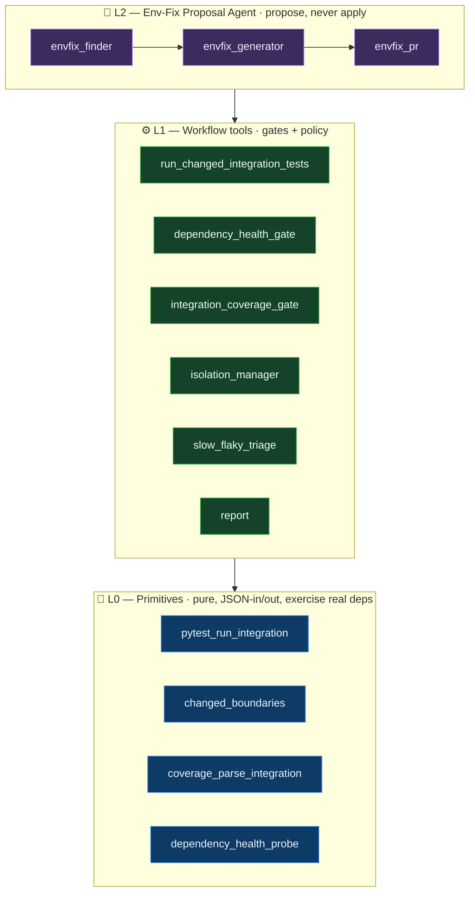
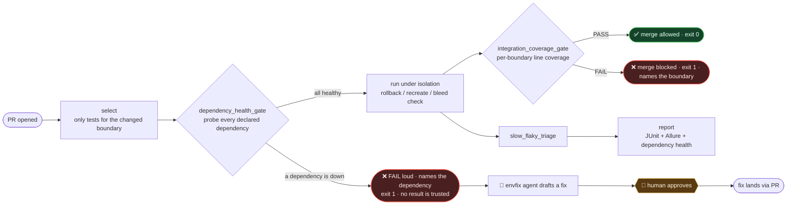

# qa_integration

**Integration-Testing QA workflow-microservice** — domain #2 of the NEXUS QA farm. An
autonomous service that takes over the routine of integration-level QA on a target repo:
it runs tests against REAL dependencies (docker-compose / testcontainers-python — real
Postgres, real Redis, real sibling services), so the human QA keeps only strategy and the
decisions a machine must not make.

Built spec-first with the [Athena](https://github.com/divnjl2/nexus-athena) planning
framework: `spec.md → scenarios.md → design.md → plan.md → hermes_master_plan.md`. Every
test is named after the scenario it proves, so **green test = spec requirement satisfied**.

## Architecture

Bottom-up: pure primitives (that talk to real deps) → policy gates → one stateful agent
that proposes but never applies. **This is the load-bearing difference from domain #1
(`qa_unit`)**: because every assertion here runs against real infrastructure, not mocks,
this domain needs a dependency-health gate and an isolation manager domain #1 doesn't.
**Interactive, clickable diagrams** (jump to source) live in
[`docs/ARCHITECTURE.md`](docs/ARCHITECTURE.md).



On a pull request:



## Зачем (нахуя)

On every PR, forever, a human QA does these chores by hand against real, flaky shared
infrastructure. This service takes them:

| Рутина руками | Делает qa_integration |
|---|---|
| поднять/проверить окружение (БД, брокер, соседний сервис) перед каждым прогоном | `dependency_health_gate` — пробит **каждую** задекларированную зависимость до того, как результату можно доверять |
| выбрать какие integration-тесты гонять на изменение конкретной границы (boundary) | `select` — только затронутая граница + fallback на full run при правке docker-compose/shared fixture |
| решить блок/нет по integration coverage на границу, включая новые границы без тестов | `gate` — per-boundary coverage; 0% = hard block, никогда "нет данных → зелёный" |
| гарантировать что тест не наследует состояние от предыдущего (rollback/recreate, bleed) | `isolation_manager` — reset после теста + fingerprint-проверка на bleed + forced serial для нересетящихся зависимостей |
| разгрести slow/flaky шум с реальной инфры, не спрятав реальный регресс | `slow_flaky_triage` — quarantine (slow) + flaky только по confirmed pass+fail на одном коммите; реальный fail остаётся red |
| найти причину падения окружения и починить руками | L2 envfix-agent находит проблему → драфтит фикс → **PR (ты аппрувишь), он не применяет** |

Two safety lines are hard, and they are the headline difference from domain #1:
- **It refuses to trust results when a dependency is down.** `dependency_health_gate`
  probes every declared dependency before any test result counts; a down or timed-out
  dependency fails loud, naming itself — it is never silently skipped (see
  `move-gate-threshold` and `waive-dependency-outage` in `GET /manifest`, R2/R2.2).
- **The env-fix agent proposes, it never auto-applies to prod.** `envfix_pr` opens a PR
  and holds no apply credential; `apply_env_fix()` raises `ApplyNotPermitted` for any
  attempt without a recorded human approval.

## Quickstart

```bash
pip install -r requirements.txt

# 1) run the suite — 66 tests, line 98.4% / branch 97.7% coverage, green = every scenario proven
python -m pytest qa_integration -q

# 2) CLI handles — gate a real coverage.xml (exit 1 blocks the PR)
python -m qa_integration gate --coverage coverage.xml --boundary-map boundaries.json
python -m qa_integration select --changed src/service_a/handler.py --boundary-map boundaries.json --test-map test_map.json
python -m qa_integration manifest
python -m qa_integration version

# 3) HTTP handle
uvicorn qa_integration.api:app        # GET /health /version /manifest, POST /gate, POST /select
```

### Real verdict, real numbers

```
python -m pytest qa_integration --cov=qa_integration --cov-branch -q
  → 66 passed, line 98.4% (845/859), branch 97.7% (86/88) coverage
```

## Layout

```
spec.md scenarios.md design.md plan.md      # Athena bundle (what/why + acceptance)
hermes_master_plan.md                       # Hermes exec plan (compiled_graph.txt not generated yet)
qa_integration/
  primitives/  L0  pytest_run_integration · changed_boundaries · coverage_parse_integration · dependency_health_probe
  tools/       L1  run_changed_integration_tests · dependency_health_gate · integration_coverage_gate ·
                   isolation_manager · slow_flaky_triage · report
  agent/       L2  envfix_finder · envfix_generator · envfix_pr  (propose → PR → STOP at human)
  ci/              pr_gate · budget · hitl_manifest
  hermes/          workflow.yaml  (Hermes farm registration: stages + HITL routing)
  config.py        thresholds + compose/fixture path classes (boundary_coverage_threshold, health_timeout_s, …)
  cli.py  api.py   the handles (CLI + HTTP)
  tests/           one test per scenario (66 tests, run_cmd == success_check)
```

## Status

Core logic is stdlib-only, **66 tests, line 98.4% / branch 97.7% coverage**
(`pytest qa_integration --cov=qa_integration --cov-branch -q`). Handles: CLI + FastAPI, both
wired to the same `select` / `gate` / `manifest` behaviour. Hermes registration
(`qa_integration/hermes/workflow.yaml`) declares the 7-stage pipeline (select → dependency
health → isolation → coverage → slow/flaky triage → env-fix → report) and mirrors the HITL
manifest. External seams — `testcontainers-python` (real dependency stacks),
`coverage.py`/`allure-pytest` (reporting), `pytest-timeout`/`pytest-rerunfailures`
(slow/flaky) — are behind dependency injection: `pytest_run_integration`'s `run=`/`clock=`
already default to a real subprocess + real clock, but `dependency_health_probe`'s `probe=`,
`envfix_finder`'s `locator=`, and `envfix_pr`'s required `vcs` collaborator are still stubs
(they raise until a real health-check/compose-locator/`gh`-client is wired in); doing that
wiring is the next increment, same as domain #1's next
increment for `gh`/`mutmut`/`allure`. No `compiled_graph.txt` yet — the Beads compile step
for this domain hasn't been run. Part of the NEXUS QA farm (domain #2), planned by Athena.
