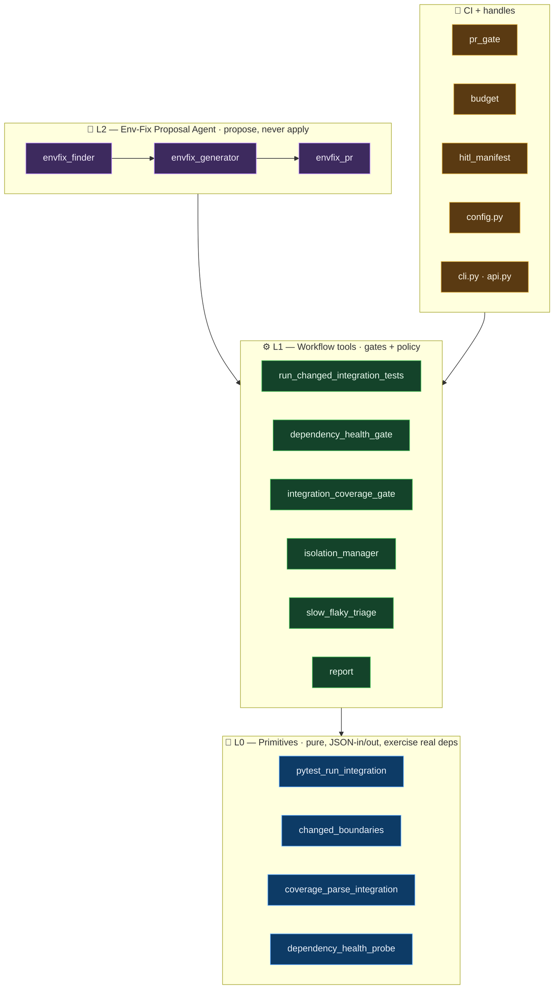
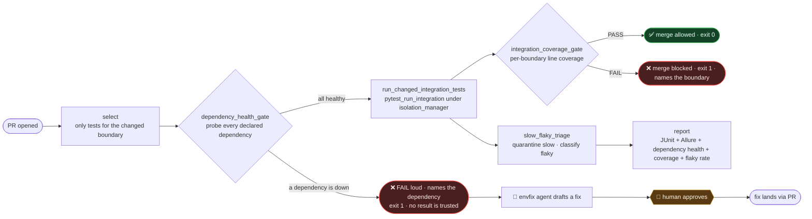
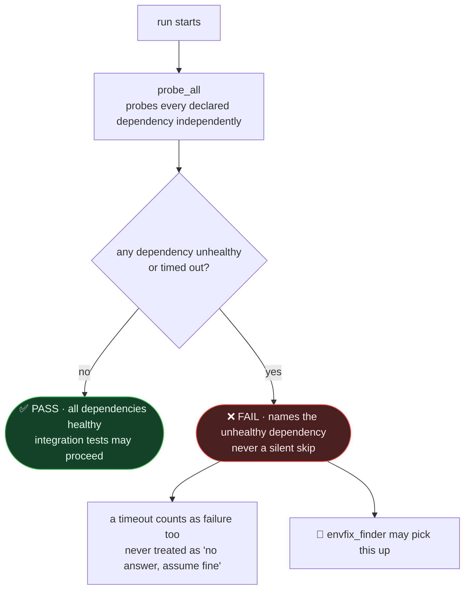
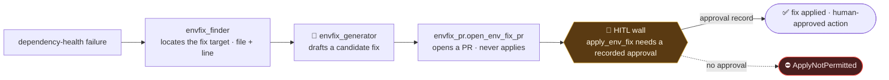
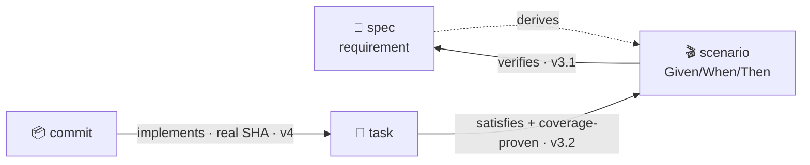
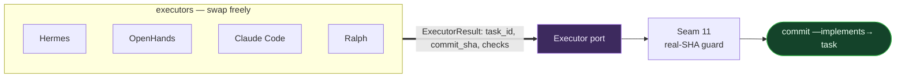

# Architecture — interactive maps

> GitHub renders these Mermaid diagrams inline. Nodes marked with a link are **clickable** —
> they jump straight to the source file.

## 1. The L0 / L1 / L2 pie

Bottom-up: pure primitives (that exercise real dependencies) → policy gates → the one
stateful agent. Click a node to open its code.

## 2. What happens on a pull request

Change → select → dependency health → run (isolated) → coverage → gate → report.

## 3. The dependency-health gate (why a green run is a green run)

This is the headline difference from domain #1: `qa_unit` never touches live infra, so it
has nothing to probe. `qa_integration` runs against real dependencies, so a "PASS" is only
trustworthy if every declared dependency actually answered healthy — never inferred, never
skipped.

## 4. The HITL / env-fix safety boundary (why you can delegate)

The agent proposes; it **holds no apply credential** to any shared or production
environment. Every drafted fix crosses a human approval gate before it can be applied.

## 5. Provenance — how this repo ties to Athena (the closed loop)

Built by the [Athena](https://github.com/divnjl2/nexus-athena) planner, the same loop as
domain #1. Every edge is proven: `verifies` (v3.1) · `satisfies` coverage-proven (v3.2) ·
`implements` real SHA (v4).

## 6. Executor port (v4) — the frame doesn't care who writes the code

Hermes / OpenHands / Claude Code / Ralph are interchangeable adapters behind one contract —
identical to domain #1, since the executor port lives in Athena, not in the QA domain.

